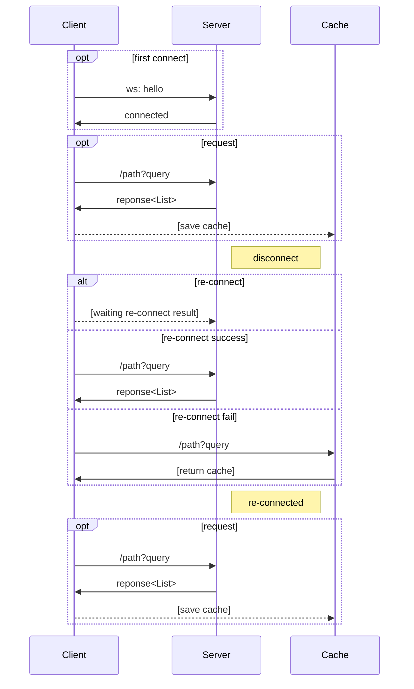

```mermaid
  sequenceDiagram

  participant C as Client
  participant S as Server

  opt first connect
    C ->> S: ws: hello
    S ->> C: connected
  end

  opt request
    C ->> S: /path?query
    S ->> C: reponse<List>
    C -->> Cache: [save cache]
  end

  Note right of S: disconnect

  alt re-connect
    C -->> S: [waiting re-connect result]
  else re-connect success
    C ->> S: /path?query
    S ->> C: reponse<List>
  else re-connect fail
    C ->> Cache: /path?query
    Cache ->> C: [return cache]
  end

  Note right of S: re-connected

  opt request
    C ->> S: /path?query
    S ->> C: reponse<List>
    C -->> Cache: [save cache]
  end
```
